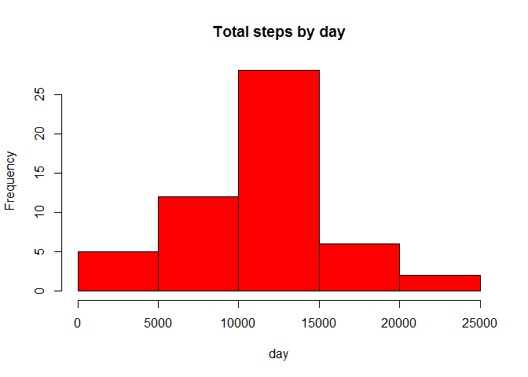
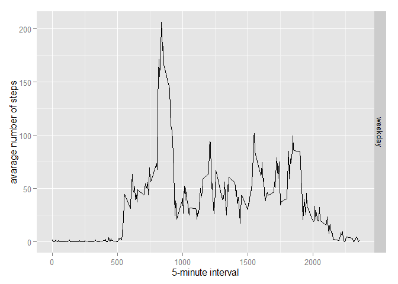

# Reproducible Research: Peer Assessment 1

##Loading and preprocessing the data


```r
rawdata <- read.csv("activity.csv")
adata <- na.omit(rawdata)
adata$date <- as.factor(as.character(adata$date))
```

##What is mean total number of steps taken per day?

Calculate the total number of steps taken per day


```r
StepsTotal <- aggregate(steps ~ date, data = rawdata, sum, na.rm = TRUE)
```

Make a histogram of the total number of steps taken each day


```r
hist(StepsTotal$steps, main = "Total steps by day", xlab = "day", col = "red")
```

 

Calculate and report the mean and median of the total number of steps taken per day


```r
mean(StepsTotal$steps)
```

```
## [1] 10766.19
```

```r
median(StepsTotal$steps)
```

```
## [1] 10765
```

##What is the average daily activity pattern?

Make a time series plot 


```r
time_series <- tapply(rawdata$steps, rawdata$interval, mean, na.rm = TRUE)
plot(row.names(time_series), time_series, type = "l", xlab = "5-min interval", ylab = "Average across all Days", main = "Average number of steps taken", col = "red")
```

 

Which 5-minute interval, on average across all the days in the dataset, contains the maximum number of steps?


```r
max_interval <- which.max(time_series)
names(max_interval)
```

```
## [1] "835"
```

##Imputing missing values

Calculate and report the total number of missing values in the dataset 


```r
activity_NA <- sum(is.na(rawdata))
activity_NA
```

```
## [1] 2304
```

Devise a strategy for filling in all of the missing values in the dataset


```r
StepsAverage <- aggregate(steps ~ interval, data = rawdata, FUN = mean)
fillNA <- numeric()
for (i in 1:nrow(rawdata)) {
     obs <- rawdata[i, ]
     if (is.na(obs$steps)) {
     steps <- subset(StepsAverage, interval == obs$interval)$steps
     } else {
    steps <- obs$steps
     }
     fillNA <- c(fillNA, steps)
     }
```

Create a new dataset that is equal to the original dataset but with the missing data filled in


```r
new_activity <- rawdata
new_activity$steps <- fillNA
```

Make a histogram of the total number of steps taken each day and Calculate and report the mean and median total number of steps taken per day


```r
StepsTotal2 <- aggregate(steps ~ date, data = new_activity, sum, na.rm = TRUE)
hist(StepsTotal2$steps, main = "Total steps by day", xlab = "day", col = "red")
```

 

```r
mean(StepsTotal2$steps)
```

```
## [1] 10766.19
```

```r
median(StepsTotal2$steps)
```

```
## [1] 10766.19
```

##Are there differences in activity patterns between weekdays and weekends?

Create a new factor variable in the dataset with two levels - "weekday" and "weekend" indicating whether a given date is a weekday or weekend day


```r
rawdata$date <- as.Date(rawdata$date, "%Y-%m-%d")
day <- weekdays(rawdata$date)
daylevel <- vector()
rawdata$dateType <-  ifelse(as.POSIXlt(rawdata$date)$wday %in% c(0,6), 'weekend', 'weekday')
averagedActivityDataImputed <- aggregate(steps ~ interval + dateType, data=rawdata, mean)
```

Make a panel plot containing a time series plot of the 5-minute interval (x-axis) and the average number of steps taken, averaged across all weekday days or weekend days (y-axis) 


```r
library(ggplot2)
```

```
## Warning: package 'ggplot2' was built under R version 3.1.3
```

```r
ggplot(averagedActivityDataImputed, aes(interval, steps)) + 
     geom_line() + 
     facet_grid(dateType ~ .) +
     xlab("5-minute interval") + 
     ylab("avarage number of steps")
```

 


```
